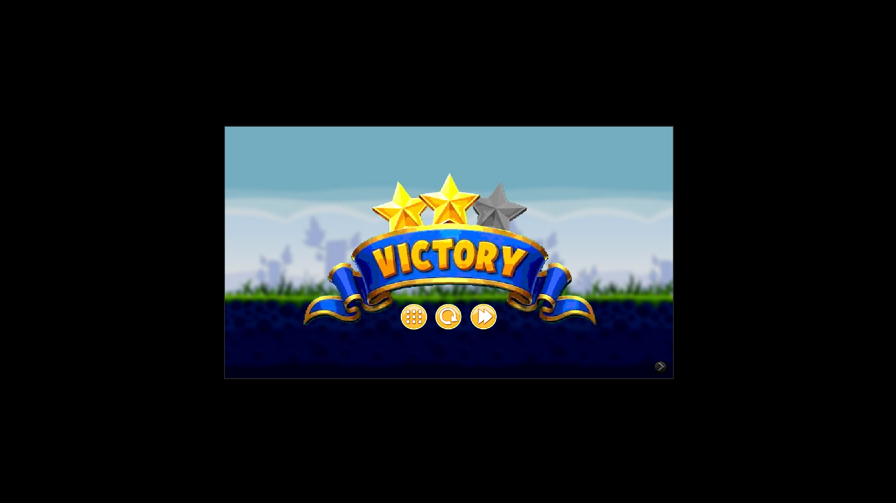

# AngryBirds
- CSE201 Game development project at IIITD using Java

## How to install? 
- Ensure you have and `java` installed on your system
- Note: you do not necessarily need to install `gradle` since there already exists a gradle wrapper binary for both Windows and Linux based systems included with the project `(src/gradlew or src/gradlew.bat)`
- For Arch Linux,
```
sudo pacman -S jdk-openjdk
```
- Then clone the git repository from github
```
git clone https://github.com/aditya23043/AngryBirds
```

## How to run the code
- Go to the `src/` directory in the git repo
```
cd src
```
- Run the program using the gradle wrapper binary
```
./gradlew run
```

## Uninstallation
- If you need to uninstall this game, just remove the git repo and your system will automatically remove temporary files / cache created for running the game
```
rm -rf AngryBirds
rm -rf ~/.cache
```

## Credits
- The red background on the main menu, level selector and help menu screen is from https://www.wallpaperflare.com/abstract-red-minimalism-red-background-backgrounds-pattern-wallpaper-pxfri
- The birds, pigs and catapult's sprites along with the 1st level's background were taken from https://angrybirds.fandom.com/wiki/Angry_Birds_Wiki
- The victory screen was originally picked from https://canva.com and then edited on https://www.pinta-project.com to achieve the final result
- All the buttons were made by us while taking inspiration from the color palette of the game as mentioned in the angrybirds wiki mentioned above
- Angry Birds font was taken from https://dafont.com

# Demo
- All functionalities of the game in its current state have been mentioned in the HELP menu with proper screenshots





